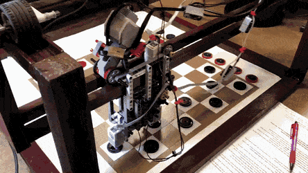
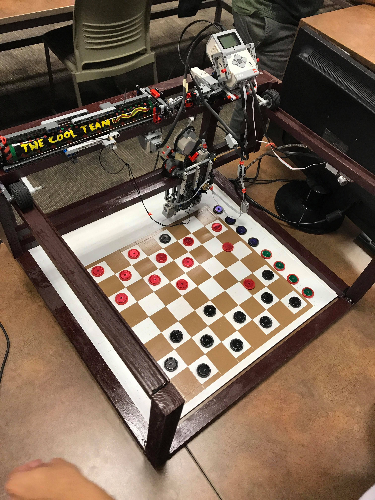
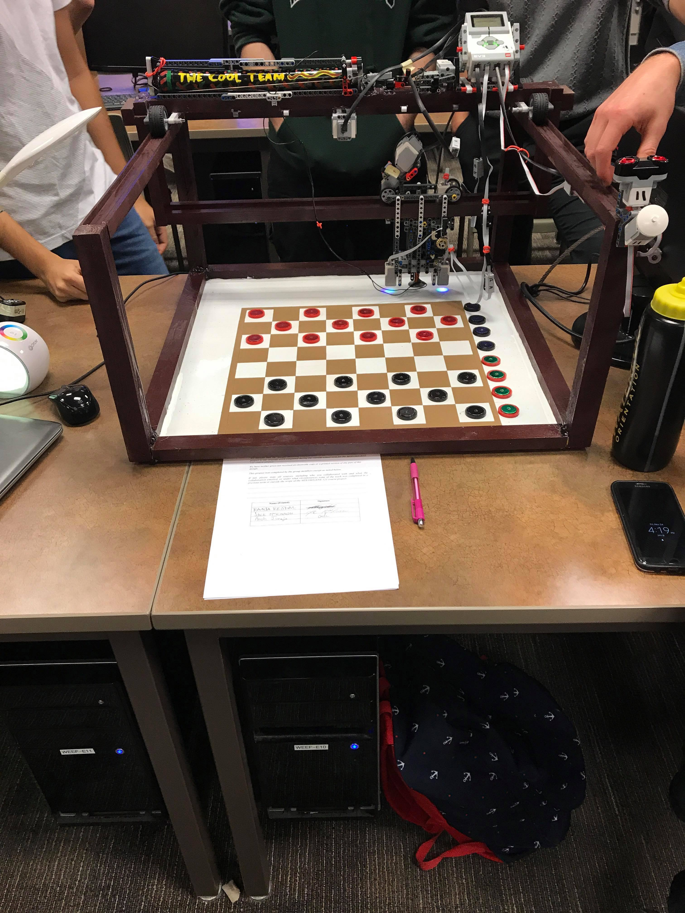
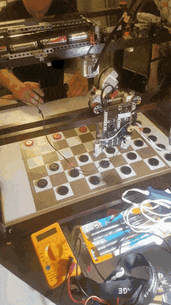

# Autonomous Checkers Robot

A fully autonomous robot that plays checkers with a human opponent.
Uses motors and sensors from the Lego Mindstorms kit, an electromagnet to grab pieces, and a wooden frame to house the moving parts.

Order of Operations:

1. Scans board using color sensors
2. Determines best move
3. Makes move using electromagnet
4. Returns to start

